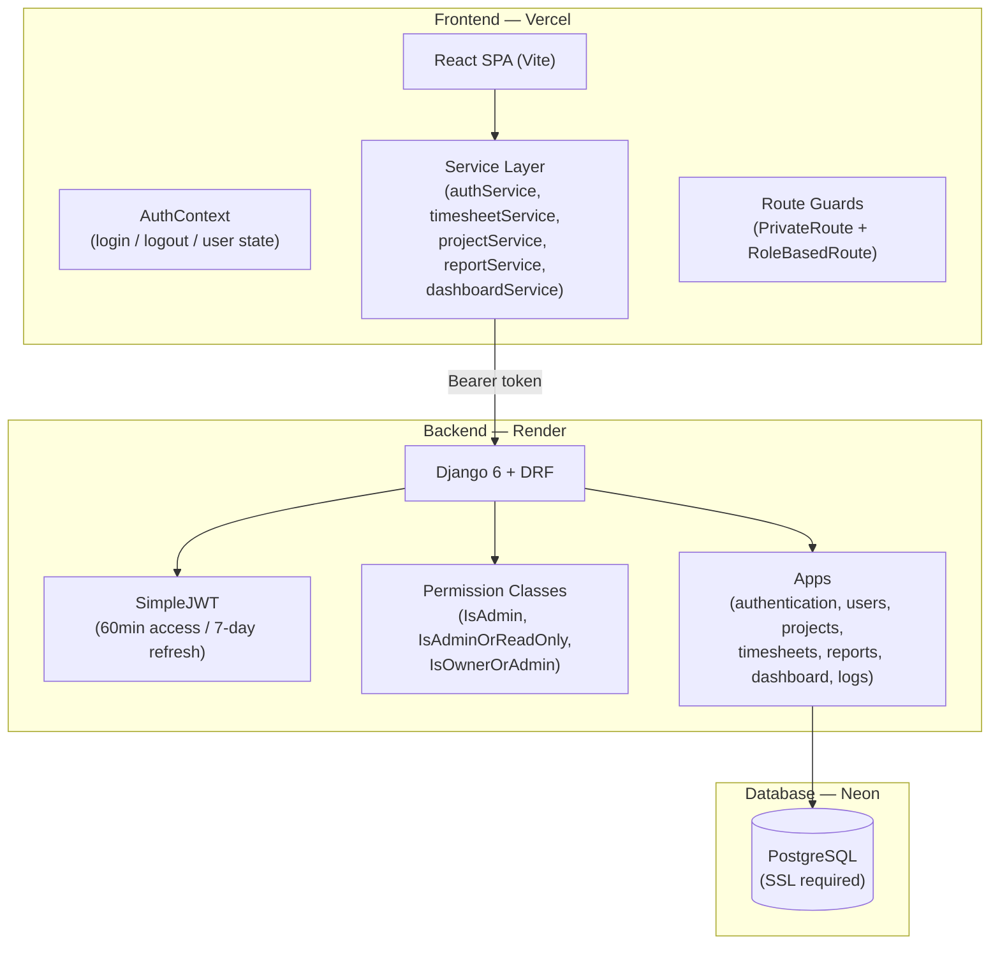
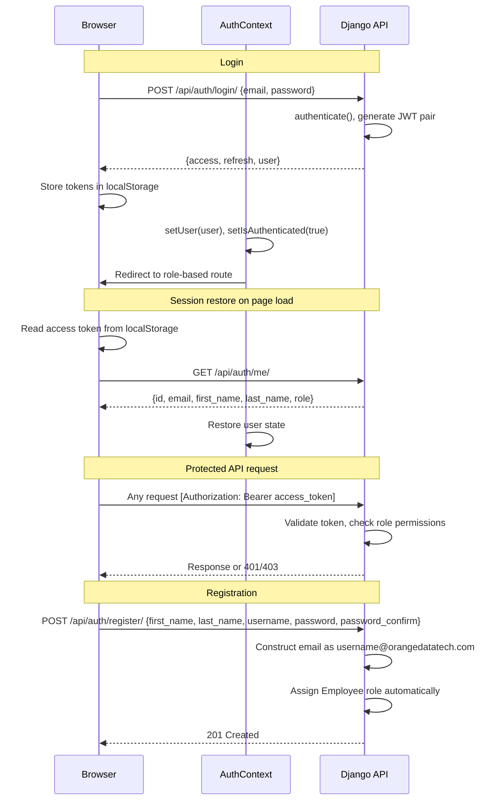
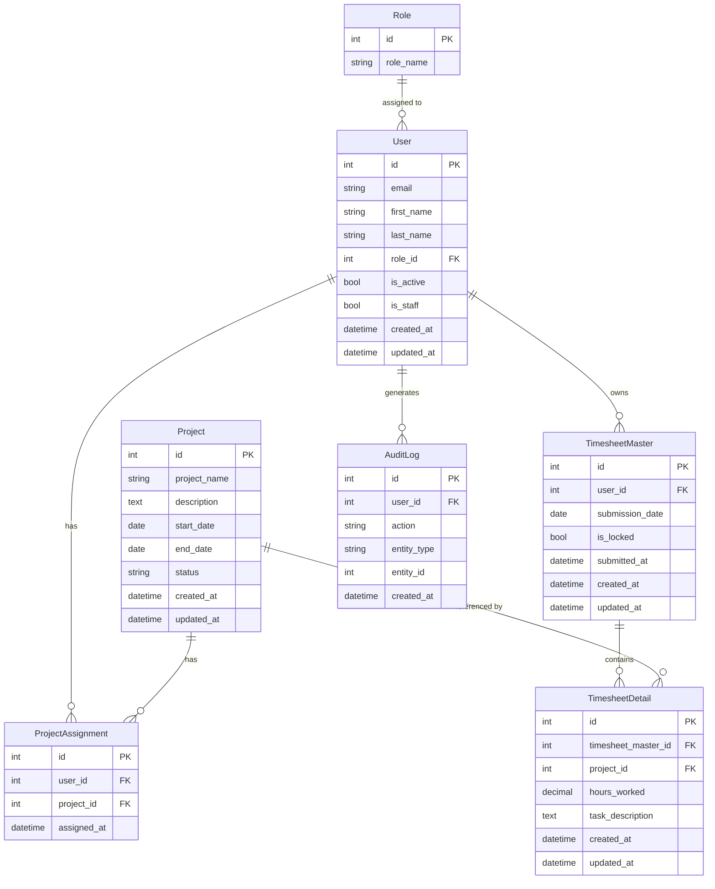
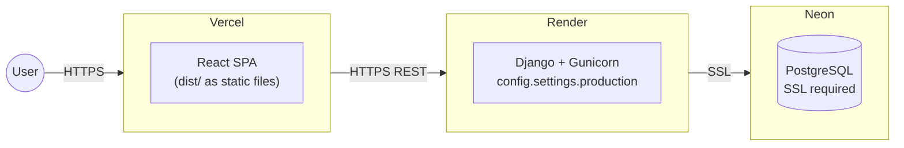

<div align="center">

# Timesheet Management System

**A full-stack web application for employee time tracking and project-based hour logging, built during an internship at Orange Data Tech.**

[](https://react.dev/)
[](https://vitejs.dev/)
[](https://www.djangoproject.com/)
[](https://www.django-rest-framework.org/)
[](https://neon.tech/)
[](https://tailwindcss.com/)
[](LICENSE)

[Live Demo](https://timesheet-management-system-five.vercel.app/) · [Backend API](https://timesheet-management-system-soi9.onrender.com) · [Repository](https://github.com/AnoushkaKanchan/timesheet-management-system)

</div>

---

## Table of Contents

- [Overview](#overview)
- [Internship Context](#internship-context)
- [Live Demo](#live-demo)
- [Screenshots](#screenshots)
- [Key Features](#key-features)
- [Technology Stack](#technology-stack)
- [System Architecture](#system-architecture)
- [Authentication Flow](#authentication-flow)
- [Folder Structure](#folder-structure)
- [Database Design](#database-design)
- [API Overview](#api-overview)
- [Installation Guide](#installation-guide)
- [Environment Variables](#environment-variables)
- [Deployment Architecture](#deployment-architecture)
- [Challenges Faced](#challenges-faced)
- [Key Learnings](#key-learnings)
- [Future Improvements](#future-improvements)
- [Author](#author)
- [License](#license)

---

## Overview

The Timesheet Management System is a role-based web application that lets employees log daily work hours against assigned projects and submit them for record-keeping. Admins get a dashboard with monthly metrics, project management tools, organization-wide timesheet visibility, and a filterable report that exports to CSV.

The project uses a two-tier timesheet model: a `TimesheetMaster` record acts as the submission header (date, ownership, lock state), while `TimesheetDetail` records hold the individual project-hour line items. Submitting a timesheet sets an `is_locked` flag, making the record read-only.

Registration is domain-constrained: new accounts are created with an `@orangedatatech.com` email constructed from a username prefix supplied at signup, and are automatically assigned the Employee role.

---

## Internship Context

This project was developed during an internship at **Orange Data Tech**, Indore. It was built from scratch as a practical exercise in designing and deploying a full-stack web application — including database modeling, REST API design, JWT authentication, role-based access control, and cloud deployment across separate frontend and backend services.

---

## Live Demo

| Service | URL |
|---|---|
| Frontend | https://timesheet-management-system-five.vercel.app/ |
| Backend API | https://timesheet-management-system-soi9.onrender.com |

> The backend runs on Render's free tier. The first request after a period of inactivity may be slow due to cold starts.

---

## Screenshots

> Screenshots will be added once the deployment is stable.

| View | Preview |
|---|---|
| Login | *(coming soon)* |
| Admin Dashboard | *(coming soon)* |
| Project Management | *(coming soon)* |
| Timesheets (Admin View) | *(coming soon)* |
| Reports & CSV Export | *(coming soon)* |
| Employee Timesheet Submission | *(coming soon)* |

---

## Key Features

**Authentication**
- Email + password login returning JWT access and refresh tokens
- User registration with automatic `@orangedatatech.com` email construction from a username prefix
- New accounts are always assigned the Employee role at creation
- Session restored on page load by calling `/auth/me/` if a token exists in localStorage
- Route guards: `PrivateRoute` (checks authentication) and `RoleBasedRoute` (checks role)

**Admin**
- Dashboard with monthly metrics: active projects, active users, total timesheets, locked timesheets, and total hours logged — filterable by month via a dropdown
- Full project CRUD: create, update, and delete projects with name, description, status, start and end dates
- Organization-wide timesheet list with modal drill-down into detail line items
- Filterable reports by employee email, project, and date range — with a summary card showing total records and total hours, plus CSV export

**Employee**
- Submit and manage personal timesheets (one master record per submission date)
- Add, edit, and delete detail line items (project + hours + task description) on any unlocked timesheet
- Submit a timesheet to lock it permanently — locked timesheets cannot be modified or deleted
- View all personal timesheet history

**Access Control**
- `IsAdmin` permission: restricts access to admin-only endpoints (dashboard stats, reports)
- `IsAdminOrReadOnly` permission: allows all authenticated users to read projects; only admins can write
- `IsOwnerOrAdmin` permission: employees can only access their own timesheets; admins see all
- All permissions are enforced server-side on every request

---

## Technology Stack

| Layer | Technology | Version |
|---|---|---|
| Frontend Framework | React | 19 |
| Build Tool | Vite | 8 |
| Routing | React Router DOM | 7 |
| HTTP Client | Axios | 1.17 |
| Form Handling | React Hook Form | 7.77 |
| Notifications | React Toastify | 11.1 |
| Styling | Tailwind CSS | 4 (via `@tailwindcss/vite`) |
| Backend Framework | Django | 6.0.5 |
| REST Layer | Django REST Framework | 3.17 |
| Authentication | djangorestframework-simplejwt | 5.5 |
| CORS | django-cors-headers | 4.9 |
| Filtering | django-filter | 25.2 |
| Database Adapter | psycopg + psycopg2-binary | 3.3 / 2.9 |
| Config Management | python-decouple | 3.8 |
| WSGI Server | gunicorn | 26.0 |
| Database | PostgreSQL (Neon) | — |
| Frontend Hosting | Vercel | — |
| Backend Hosting | Render | — |

---

## System Architecture

The application is a decoupled SPA + REST API. The React frontend communicates with the Django backend exclusively over HTTP, with JWT tokens attached to every protected request. The database is hosted on Neon (serverless PostgreSQL).



---

## Authentication Flow



> **Note:** There is no automatic token refresh in the current Axios client. If the 60-minute access token expires while the user is active, subsequent requests will receive a 401 and the user will need to log in again.

---

## Folder Structure

Generated from the actual repository:

```
timesheet-management-system/
├── .gitignore
│
├── backend/
│   ├── manage.py
│   ├── config/
│   │   ├── urls.py                    # Root URL config
│   │   ├── wsgi.py
│   │   ├── asgi.py
│   │   └── settings/
│   │       ├── base.py                # Shared settings (JWT, DRF, DB, CORS)
│   │       ├── development.py         # Inherits base; DEBUG=True
│   │       └── production.py          # Inherits base; DEBUG=False
│   │
│   ├── requirements/
│   │   ├── base.txt                   # All dependencies
│   │   ├── dev.txt                    # Extends base (currently identical)
│   │   └── prod.txt                   # Extends base (currently identical)
│   │
│   └── apps/
│       ├── authentication/            # Login, current-user endpoint, permissions
│       │   ├── views.py               # LoginView, CurrentUserView
│       │   ├── serializers.py         # LoginSerializer, UserSerializer
│       │   ├── permissions.py         # IsAdmin, IsEmployee, IsAdminOrReadOnly
│       │   └── urls.py
│       │
│       ├── users/                     # Custom User model, Role model, registration
│       │   ├── models.py              # User (AbstractBaseUser), Role, UserManager
│       │   ├── serializers.py         # RegisterSerializer
│       │   ├── views.py               # RegisterView
│       │   └── urls.py
│       │
│       ├── projects/                  # Project CRUD
│       │   ├── models.py              # Project, ProjectAssignment
│       │   ├── serializers.py
│       │   ├── views.py               # ProjectListCreateView, ProjectDetailView
│       │   └── urls.py
│       │
│       ├── timesheets/                # Two-model timesheet system
│       │   ├── models.py              # TimesheetMaster, TimesheetDetail
│       │   ├── serializers.py
│       │   ├── permissions.py         # IsOwnerOrAdmin, IsDetailOwnerOrAdmin
│       │   ├── views.py               # CRUD + SubmitTimesheetView
│       │   └── urls.py
│       │
│       ├── reports/                   # Report preview + CSV export (admin only)
│       │   ├── serializers.py         # ReportRowSerializer
│       │   ├── views.py               # ReportPreviewView, ReportExportCSVView
│       │   └── urls.py
│       │
│       ├── dashboard/                 # Monthly admin metrics
│       │   ├── views.py               # DashboardStatsView
│       │   └── urls.py
│       │
│       └── logs/                      # AuditLog model only — no API endpoints
│           └── models.py              # AuditLog (user, action, entity_type, entity_id)
│
└── frontend/
    ├── index.html
    ├── vite.config.js                 # React + Tailwind CSS v4 plugins
    ├── package.json
    └── src/
        ├── main.jsx
        ├── App.jsx
        │
        ├── constants/
        │   └── apiEndpoints.js        # Centralised API path constants
        │
        ├── context/
        │   └── AuthContext.jsx        # Auth state, login/logout, session restore
        │
        ├── utils/
        │   └── tokenStorage.js        # localStorage helpers for JWT tokens
        │
        ├── services/
        │   ├── apiClient.js           # Axios instance + Authorization header interceptor
        │   ├── authService.js         # loginUser, getCurrentUser, registerUser
        │   ├── timesheetService.js    # CRUD + submit for masters and details
        │   ├── projectService.js      # CRUD for projects
        │   ├── reportService.js       # Report preview + CSV export (blob)
        │   └── dashboardService.js    # getDashboardStats
        │
        ├── routes/
        │   ├── AppRoutes.jsx          # All route definitions
        │   ├── PrivateRoute.jsx        # Redirects unauthenticated users to /login
        │   └── RoleBasedRoute.jsx     # Redirects users with wrong role to /login
        │
        ├── layouts/
        │   ├── AdminLayout.jsx
        │   ├── EmployeeLayout.jsx
        │   ├── AuthLayout.jsx
        │   └── MainLayout.jsx
        │
        ├── pages/
        │   ├── auth/
        │   │   ├── Login.jsx
        │   │   └── Register.jsx
        │   ├── admin/
        │   │   ├── Dashboard.jsx      # Monthly metrics with MonthSelector
        │   │   ├── Projects.jsx       # Project CRUD
        │   │   ├── Timesheets.jsx     # All employee timesheets
        │   │   └── Reports.jsx        # Filterable report + CSV export
        │   └── employee/
        │       ├── MyTimesheets.jsx   # Employee timesheet management
        │       ├── History.jsx        # Exists — not yet registered as a route
        │       └── Dashboard.jsx      # Exists — route uses an inline stub instead
        │
        ├── components/
        │   ├── common/
        │   │   ├── Loader.jsx
        │   │   ├── Navbar.jsx
        │   │   └── Sidebar.jsx
        │   ├── dashboard/
        │   │   ├── DashboardCard.jsx
        │   │   ├── MonthSelector.jsx
        │   │   ├── ProjectsOverview.jsx
        │   │   └── RecentTimesheetsTable.jsx
        │   ├── projects/
        │   │   ├── ProjectForm.jsx
        │   │   ├── ProjectModal.jsx
        │   │   └── ProjectsTable.jsx
        │   ├── reports/
        │   │   ├── ReportFilters.jsx
        │   │   ├── ReportSummaryCards.jsx
        │   │   └── ReportsTable.jsx
        │   └── timesheets/
        │       ├── EmployeeTimesheetsTable.jsx
        │       ├── TimesheetDetailForm.jsx
        │       ├── TimesheetDetailsTable.jsx
        │       ├── TimesheetFilters.jsx
        │       ├── TimesheetForm.jsx
        │       ├── TimesheetModal.jsx
        │       ├── TimesheetViewModal.jsx
        │       └── TimesheetsTable.jsx
        │
        └── styles/
            └── index.css
```

---

## Database Design

Five tables are in active use. The `AuditLog` table is migrated and present in the database but has no API endpoints.



**Design notes:**

- `Role` is a separate database table, not a CharField on `User`. This allows roles to be managed via the Django admin without code changes
- All users registered through the API are automatically assigned the `Employee` role. The `Admin` role must be assigned manually through the Django admin or shell
- `TimesheetMaster` uses `is_locked` (boolean) rather than an approval status field. Once submitted, a timesheet is permanently locked — there is no admin unlock endpoint
- `ProjectAssignment` enforces `unique_together` on `(user, project)` to prevent duplicate assignments. The model is migrated, but there are no API endpoints for it; assignments must be managed via the Django admin
- All PostgreSQL connections enforce `sslmode=require`
- The `AuditLog` model is migrated and ready but has no views or URL registrations in the current implementation

---

## API Overview

Base URL: `https://timesheet-management-system-soi9.onrender.com/api`

### Authentication

| Method | Endpoint | Auth Required | Description |
|---|---|---|---|
| `POST` | `/auth/login/` | None | Returns `access` token, `refresh` token, and `user` object |
| `GET` | `/auth/me/` | Bearer token | Returns the currently authenticated user |
| `POST` | `/auth/register/` | None | Registers a new Employee-role user |

**Login request:**
```json
{ "email": "jane.doe@orangedatatech.com", "password": "..." }
```

**Login response:**
```json
{
  "access": "<access_token>",
  "refresh": "<refresh_token>",
  "user": { "id": 1, "email": "jane.doe@orangedatatech.com", "first_name": "Jane", "last_name": "Doe", "role": "Employee" }
}
```

**Register request:**
```json
{ "first_name": "Jane", "last_name": "Doe", "username": "jane.doe", "password": "...", "password_confirm": "..." }
```

The `username` field is combined with `@orangedatatech.com` by the backend to form the email. If the user includes `@` in the username field, the domain portion is stripped before concatenation.

---

### Projects

All authenticated users can read. Only `Admin` can write.

| Method | Endpoint | Auth | Description |
|---|---|---|---|
| `GET` | `/projects/` | Bearer | List all projects |
| `POST` | `/projects/` | Admin | Create a project |
| `GET` | `/projects/{id}/` | Bearer | Get a single project |
| `PUT` | `/projects/{id}/` | Admin | Update a project |
| `DELETE` | `/projects/{id}/` | Admin | Delete a project |

**Project fields:** `id`, `project_name`, `description`, `start_date`, `end_date`, `status` (`ACTIVE` / `COMPLETED` / `ON_HOLD`)

---

### Timesheets

Employees see only their own records. Admins see all. All list endpoints annotate `total_hours` via a queryset aggregate.

| Method | Endpoint | Auth | Description |
|---|---|---|---|
| `GET` | `/timesheets/` | Bearer | List timesheets scoped by role; includes `total_hours` annotation |
| `POST` | `/timesheets/` | Bearer | Create a timesheet master record |
| `GET` | `/timesheets/{id}/` | Owner or Admin | Get a single timesheet |
| `PUT` | `/timesheets/{id}/` | Owner or Admin | Update — returns 403 if `is_locked` |
| `DELETE` | `/timesheets/{id}/` | Owner or Admin | Delete — returns 403 if `is_locked` |
| `POST` | `/timesheets/{id}/submit/` | Owner or Admin | Lock the timesheet (sets `is_locked=True`, records `submitted_at`) |

**Timesheet Detail lines:**

| Method | Endpoint | Auth | Description |
|---|---|---|---|
| `GET` | `/timesheets/details/` | Bearer | List detail lines; filter by `?timesheet_master=<id>` |
| `POST` | `/timesheets/details/` | Bearer | Add a line — returns 403 if parent master is locked |
| `GET` | `/timesheets/details/{id}/` | Owner or Admin | Get a line |
| `PUT` | `/timesheets/details/{id}/` | Owner or Admin | Update a line — returns 403 if parent master is locked |
| `DELETE` | `/timesheets/details/{id}/` | Owner or Admin | Delete a line — returns 403 if parent master is locked |

---

### Reports (Admin only)

Both endpoints support the same optional query parameters: `employee` (email substring), `project` (project ID), `start_date` (YYYY-MM-DD), `end_date` (YYYY-MM-DD).

| Method | Endpoint | Auth | Description |
|---|---|---|---|
| `GET` | `/reports/` | Admin | JSON preview with `summary` (total_records, total_hours) and `results` array |
| `GET` | `/reports/export/` | Admin | Downloads `timesheet_allocations_report.csv` |

---

### Dashboard (Admin only)

| Method | Endpoint | Auth | Description |
|---|---|---|---|
| `GET` | `/dashboard/stats/` | Admin | Monthly metrics; accepts `?month=YYYY-MM` |

**Response shape:**
```json
{
  "selected_month": "2026-06",
  "selectable_months": [{ "value": "2026-06", "label": "June 2026" }],
  "metrics": {
    "total_projects_active_this_month": 3,
    "active_users_this_month": 5,
    "total_timesheets_submitted": 12,
    "submitted_timesheets": 10,
    "locked_timesheets": 10,
    "total_hours_logged": 320.0
  }
}
```

---

## Installation Guide

### Prerequisites

| Tool | Version |
|---|---|
| Python | 3.11+ |
| Node.js | 18+ |
| npm | 9+ |
| Git | any |
| PostgreSQL | Neon account or local instance |

---

### Backend Setup

```bash
git clone https://github.com/AnoushkaKanchan/timesheet-management-system.git
cd timesheet-management-system/backend
```

**macOS / Linux**
```bash
python3 -m venv venv
source venv/bin/activate
pip install -r requirements/dev.txt
```

**Windows (PowerShell)**
```powershell
python -m venv venv
venv\Scripts\Activate.ps1
pip install -r requirements/dev.txt
```

```bash
# Create .env file (see Environment Variables section below)

# Run migrations
python manage.py makemigrations
python manage.py migrate

# Create an admin user
# Note: /register always assigns Employee role — admin must be created here
python manage.py createsuperuser

# Start the server
python manage.py runserver --settings=config.settings.development
# API available at http://127.0.0.1:8000/api/
```

> **After running `createsuperuser`:** Open the Django admin at `http://127.0.0.1:8000/admin/`, create a `Role` record with `role_name = "Admin"`, and assign it to the superuser. Without a Role assigned, admin-only endpoints will error.

---

### Frontend Setup

```bash
cd timesheet-management-system/frontend
npm install

# Create .env file (see Environment Variables section)

npm run dev
# App available at http://localhost:5173
```

**Available scripts:**
```bash
npm run dev       # Development server with HMR
npm run build     # Production build → dist/
npm run preview   # Serve the production build locally
npm run lint      # Run ESLint
```

---

## Environment Variables

### Backend (`.env` in `backend/`)

```env
SECRET_KEY=your-django-secret-key
DEBUG=True

ALLOWED_HOSTS=localhost,127.0.0.1

DB_NAME=your_database_name
DB_USER=your_database_user
DB_PASSWORD=your_database_password
DB_HOST=your_database_host
DB_PORT=5432

CORS_ALLOWED_ORIGINS=http://localhost:5173
```

Settings are loaded via `python-decouple`. The database connection always enforces `sslmode=require`. For Neon, the `DB_HOST` is the Neon connection string hostname.

### Frontend (`.env` in `frontend/`)

```env
VITE_API_BASE_URL=http://127.0.0.1:8000/api
```

In production, set `VITE_API_BASE_URL` to the Render backend URL in the Vercel project environment variables dashboard.

---

## Deployment Architecture



**Frontend (Vercel)**
- Build command: `npm run build`
- Output directory: `dist`
- Set `VITE_API_BASE_URL` as an environment variable in the Vercel project settings

**Backend (Render)**
- Start command: `gunicorn config.wsgi:application`
- Set `DJANGO_SETTINGS_MODULE=config.settings.production` along with all backend env vars in the Render service settings
- Production settings inherit from `base.py` and set `DEBUG=False`

**Database (Neon)**
- Serverless PostgreSQL with SSL enforced
- Provide the Neon connection credentials as individual `DB_*` environment variables

---

## Challenges Faced

**Two-model timesheet design.** Splitting timesheets into a `TimesheetMaster` header and `TimesheetDetail` line items required keeping lock-checking logic consistent across both models and all five related views. Computing `total_hours` as a queryset annotation using `Coalesce(Sum(...), Value(0))` — rather than in a serializer method — was a specific decision to avoid N+1 queries.

**Three separate permission classes.** The project needs three distinct access patterns: admin-only, admin-or-read, and owner-or-admin. Writing each as a separate DRF `BasePermission` subclass made the view declarations clear and the permission logic testable. Understanding the separation between `has_permission` (view-level) and `has_object_permission` (object-level) — and that the latter only runs if the former passes — was a non-obvious detail.

**Domain-constrained registration.** Auto-constructing `@orangedatatech.com` emails from a username prefix required handling edge cases: stripping an `@domain` suffix if the user typed one, and checking email uniqueness against the computed value rather than the raw input, all in the serializer before `create()` runs.

**Tailwind CSS v4 integration.** Version 4 uses a Vite plugin (`@tailwindcss/vite`) rather than a PostCSS config. Most online documentation and starter templates target v3, so the setup required working from the v4-specific docs.

**No token refresh handling.** The Axios client attaches the access token to every request but has no 401 interceptor to attempt a silent refresh. When the 60-minute access token expires, the user hits errors rather than a transparent re-authentication. This was identified as a gap after completing the initial implementation.

---

## Key Learnings

- **Custom User model** — extending `AbstractBaseUser` requires more setup than the default `User`, but allows using email as the login field and adding a FK to a `Role` model cleanly
- **DRF generics vs APIView** — `ListCreateAPIView` and `RetrieveUpdateDestroyAPIView` cover most CRUD patterns with minimal code; `APIView` is the right choice when the logic doesn't map to a standard pattern, such as the submit-and-lock action
- **QuerySet annotations** — computing derived fields (`total_hours`) directly on the queryset with `annotate()` avoids per-object database hits that would occur with a `SerializerMethodField`
- **Settings split** — organising settings into `base.py`, `development.py`, and `production.py` avoids duplicating shared config while keeping environment-specific values separate
- **React Context for auth state** — a single `AuthContext` with a `useAuth()` hook keeps authentication state and actions consistent across all components without prop drilling
- **Service layer in React** — putting all Axios calls in per-domain service files (`timesheetService.js`, `projectService.js`, etc.) keeps components focused on rendering and makes the API surface easy to find and change
- **Vite environment variables** — variables must be prefixed with `VITE_` to be accessible in the browser bundle; this is a build-time injection, not a runtime lookup

---

## Future Improvements

- **Token refresh** — add a 401 response interceptor in `apiClient.js` that calls `/auth/token/refresh/` with the stored refresh token, retries the original request, and logs out only if the refresh itself fails
- **Employee Dashboard** — the route at `/employee/dashboard` currently renders an inline `<h1>` stub; `pages/employee/Dashboard.jsx` exists and needs to be wired in
- **History page** — `pages/employee/History.jsx` exists in the codebase but is not registered in `AppRoutes.jsx`
- **Admin unlock** — there is no endpoint to unlock a submitted timesheet; adding an admin-only `POST /timesheets/{id}/unlock/` would allow correcting accidental submissions
- **Project assignment API** — the `ProjectAssignment` model is migrated but has no API endpoints; assignments currently require the Django admin or a direct database operation
- **Audit logging** — the `AuditLog` model is in the database; writing to it from the timesheet and project views would give admins a visible activity trail
- **Token storage** — tokens are stored in `localStorage`, which is readable by any JavaScript on the page; migrating to `httpOnly` cookies removes that exposure at the cost of CSRF considerations
- **Refresh token rotation** — `ROTATE_REFRESH_TOKENS` is currently `False` in the JWT config; enabling rotation with blacklisting would improve security for longer-lived sessions

---

## Author

**Anoushka Kanchan**  
Electronics & Instrumentation Engineering, SGSITS Indore (2024–2028)

[](https://github.com/AnoushkaKanchan)

---

## License

This project is licensed under the MIT License.

```
MIT License

Copyright (c) 2026 Anoushka Kanchan

Permission is hereby granted, free of charge, to any person obtaining a copy
of this software and associated documentation files (the "Software"), to deal
in the Software without restriction, including without limitation the rights
to use, copy, modify, merge, publish, distribute, sublicense, and/or sell
copies of the Software, and to permit persons to whom the Software is
furnished to do so, subject to the following conditions:

The above copyright notice and this permission notice shall be included in all
copies or substantial portions of the Software.

THE SOFTWARE IS PROVIDED "AS IS", WITHOUT WARRANTY OF ANY KIND, EXPRESS OR
IMPLIED, INCLUDING BUT NOT LIMITED TO THE WARRANTIES OF MERCHANTABILITY,
FITNESS FOR A PARTICULAR PURPOSE AND NONINFRINGEMENT. IN NO EVENT SHALL THE
AUTHORS OR COPYRIGHT HOLDERS BE LIABLE FOR ANY CLAIM, DAMAGES OR OTHER
LIABILITY, WHETHER IN AN ACTION OF CONTRACT, TORT OR OTHERWISE, ARISING FROM,
OUT OF OR IN CONNECTION WITH THE SOFTWARE OR THE USE OR OTHER DEALINGS IN THE
SOFTWARE.
```
